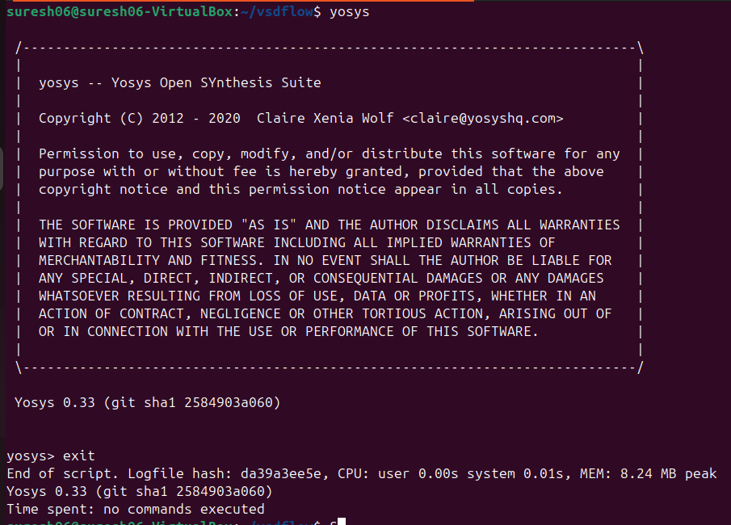
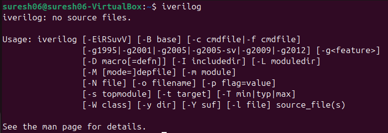
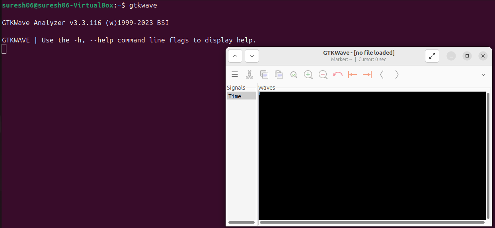
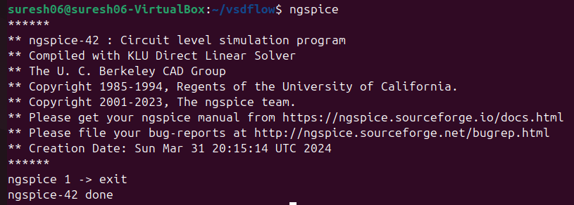
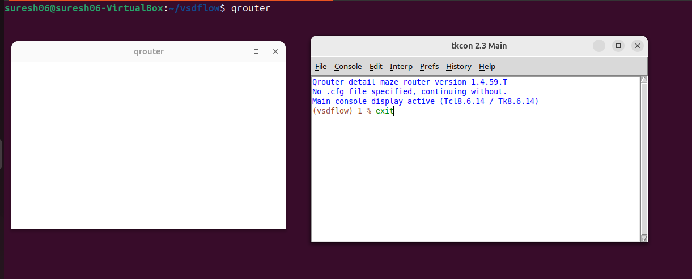
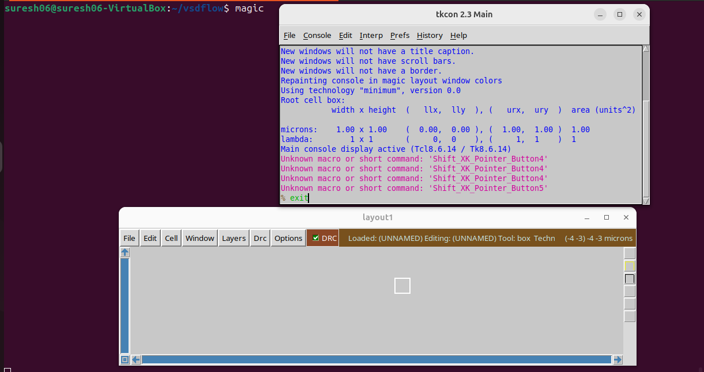

# RISC-V Reference SoC Tapeout Program VSD


#### <ins>Installation Instructions needed to follow for installing the Opensource EDA tools for RISC-V SoC Tapeout Program:</ins>

### **System Requirements**
- 6 GB RAM
- 50 GB HDD
- Ubuntu 20.04 or higher
- 4 vCPU


### **TOOLS INSTALLATION & CHECK**

## <ins>**Yosys**</ins>
##### Run these commands in terminal :
```bash
$ sudo apt-get update
$ git clone https://github.com/YosysHQ/yosys.git
$ cd yosys
$ sudo apt install make     # If make is not installed pls install it
$ sudo apt-get install build-essential clang bison flex \
    libreadline-dev gawk tcl-dev libffi-dev git \
    graphviz xdot pkg-config python3 libboost-system-dev \
    libboost-python-dev libboost-filesystem-dev zlib1g-dev
$ make config-gcc
$ make 
$ sudo make install
```
##### To check the installation run this command in terminal :
```bash
$ yosys 
```


## <ins>**Iverilog**</ins>
#### Tool Installation :
```bash
$ sudo apt-get update
$ sudo apt-get install iverilog
```
#### Tool Check :
```bash
$ iverilog
```


## <ins>**GTKWave**</ins>
#### Tool Installation :
```bash
$ sudo apt-get update
$ sudo apt-get install gtkwave
```
#### Tool Check :
```bash
$ gtkwave
```


## <ins>**ngspice**</ins>
#### Tool Installation :
```bash
$sudo apt-get update
$sudo apt-get install ngspice
```
#### Tool Check :
```bash
$ ngspice
```



## <ins>**qrouter**</ins>
#### Tool Installation :
```bash
$sudo apt-get update
$sudo apt-get install qrouter
```
#### Tool Check :
```bash
$ qrouter
```


## <ins>**Magic**</ins>
#### Tool Installation :
```bash
$ sudo apt-get install m4
$ sudo apt-get install tcsh
$ sudo apt-get install csh
$ sudo apt-get install libx11-dev
$ sudo apt-get install tcl-dev tk-dev
$ sudo apt-get install libcairo2-dev
$ sudo apt-get install mesa-common-dev libglu1-mesa-dev
$ sudo apt-get install libncurses-dev
$ git clone https://github.com/RTimothyEdwards/magic
$ cd magic
$ ./configure
$ make
$ make install 
```
#### Tool Check :
```bash
$ magic
```


